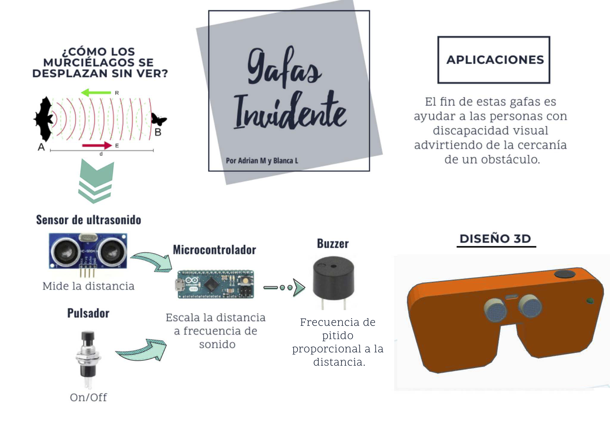

# GAFAS PARA INVIDENTES
Dispositivo para personas invidentes, que le advierta de la cercanía de un obstáculo a través de la frecuencia de sonido de un zumbador. De forma que mientras más cerca esté el objeto mayor sea la frecuencia de pitido

En el repositorio puedes encontrar:
- [Memoria del proyecto en PDF](https://github.com/Josepujol/ProyectosEstudiantes/blob/master/GafasInvidentes/MemoriaGafas.pdf)
- [Cartel para la Feria de la Ciencia](https://github.com/Josepujol/ProyectosEstudiantes/blob/master/GafasInvidentes/CartelGafas.pdf)
- [Código de Arduino](https://github.com/Josepujol/ProyectosEstudiantes/blob/master/GafasInvidentes/Codigo_gafas.ino)
- [Archivo STL con el diseño 3D de las Gafas](https://github.com/Josepujol/ProyectosEstudiantes/blob/master/GafasInvidentes/Gafas.stl)
- [Archivo STL con el diseño 3D de la tapa de las Gafas](https://github.com/Josepujol/ProyectosEstudiantes/blob/master/GafasInvidentes/Tapa%20gafas.stl)
- [Esquema electronico de conexión](https://github.com/Josepujol/ProyectosEstudiantes/blob/master/GafasInvidentes/EsquematicoGafas_esquema.png)
- [Esquema en protoboard](https://github.com/Josepujol/ProyectosEstudiantes/blob/master/GafasInvidentes/EsquematicoGafas_bb.png)
- [Esquema en formato Fritzing fzz](https://github.com/Josepujol/ProyectosEstudiantes/blob/master/GafasInvidentes/EsquematicoGafas.fzz)

## LICENCIA
Este proyecto fue desarrollado durante el curso 2018/2019 en el IES Vicente Aleixandre de Sevilla en 4º de la ESO de Tecnología por Adrian Morales y Blanca Lara, con el apoyo de su profesor Jose Pujol. Se distribuye con licencia [Creative Commons Attribution-ShareAlike 4.0 International License](http://creativecommons.org/licenses/by-sa/4.0/)
